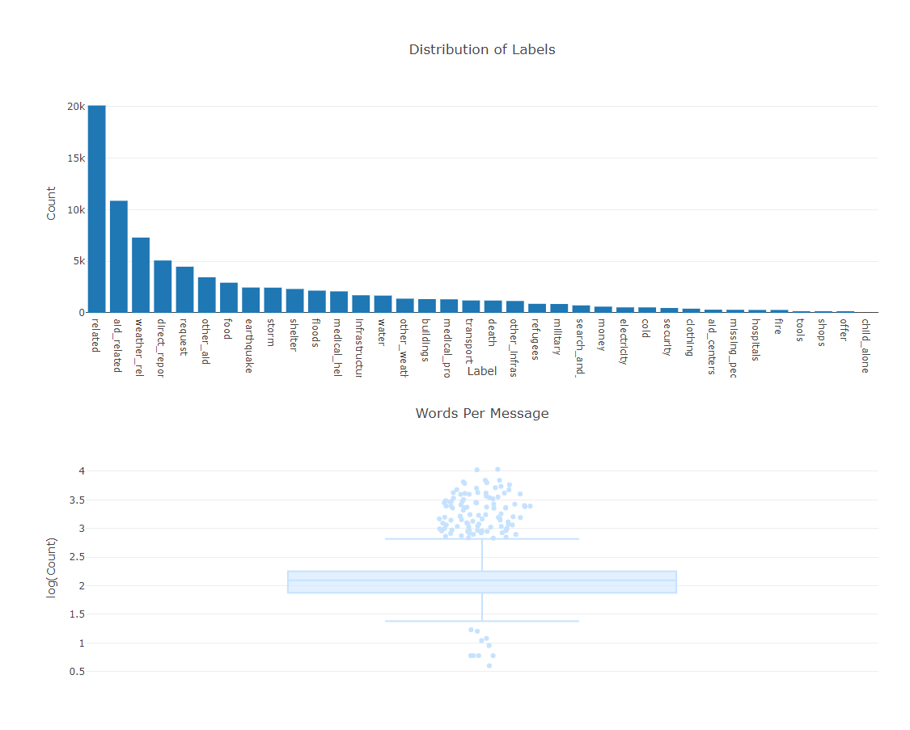

# Disaster-Response-Pipeline-Project (Udacity Data Science Nanodegree Project Two)

## Table of Contents
1.  [Description](#description)
2.  [Getting Started](#getting-started)
3.  [Authors](#authors)
4.  [Licence](#license)
5.  [Acknowledgements](#acknowledgements)
6.  [Screenshots](#screenshots)
## Description
 This project analyzes disaster data from [Figure Eight](https://appen.com/) to build a model for an API that classifies disaster messages. In this repository you'll find a data set containing real messages that were sent during disaster events. A machine learning pipeline is created to categorize these events so that you can send the messages to an appropriate disaster relief agency. This project includes a web app where an emergency worker can input a new message and get classification results in several categories. The web app will also display visualizations of the data. 

There are three major components to this project.
1. ETL Pipeline: process_data.py 
    - Loads the messages and categories datasets
    - Merges the two datasets
    - Cleans the data
    - Stores it in an SQLite database
2. ML Pipeline: train_classifier.py
    - Loads data from the SQLite database
    - Splits the dataset into training and test sets
    - Builds a text processing and machine learning pipeline
    - Trains and tunes a model using GridSearchCV
    - Outputs results on the test set
    - Exports the final model as a pickle file
3. Flask Web App
    - Visualizes dataset 
    - Applies model to new data to make predictions

**Show screenshots of web app here. **
## Getting Started
### Dependencies
- Python 3
- ETL Library: Pandas and Numpy
- Machine Learning Library: Sklearn
- Natural Language Processing Library: NLTK
- SQLite Database Library: SQLalchemy
- Serialization Library: Pickle
- Web App Library: Flask
- Data Visualization Library: Plotly
### Running the Code
- Running the ETL Pipeline
    1. Navigate to the project's data directory. 
    2. In the terminal execute `python process_data.py disaster_messages.csv disaster_categories.csv clean_messages.db`
    
- Running the ML Pipeline
    1. Navigate to the project's models directory. 
    2. In the terminal execute `python train_classifier.py ..\data\clean_messages.db saved_model.pkl`
    
    
    *'child alone' column was dropped in training because it offered no information.*

- Running the Web App
    1. Navigate to the project's app directory. 
    2. In the terminal execute `python run.py`
    3. Visit [localhost:3001](http://localhost:3001/) to view the web app
        
## Authors
     -Charles Joseph
## License
[MIT OPENSOURCE LICENSE](https://opensource.org/licenses/MIT)
## Acknowledgements
- [Udacity](https://www.udacity.com/) for designing the project, providing disaster response files and templates. 
- [Figure Eight](https://appen.com/) for providing Udacity with their data.

## Screenshots

    *The plots show that there is a large disparity in the number of positive cases. It may be possible to improve model by using resampling methods but this would have to be completed for each output individually. Alternatively, a model or models that utilizes the class_weight parameter can be used to account for the disparity in the number of positive cases. This will be done at a later date. Additionally, there are some examples with an unrealistic amount of words. These training examples can probably be deleted or word count can be added as a feature.*
